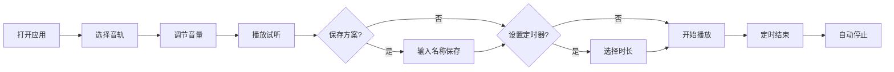

## 1. 产品概述

多轨道混合白噪音工具，帮助用户通过自定义组合自然环境音和生活背景音来提升专注力、放松身心或改善睡眠。支持多种音效轨道独立控制，可保存个性化混音方案，并提供定时关闭功能。

- **核心价值**：为用户提供沉浸式的音频环境，满足专注工作、冥想放松、助眠等多种场景需求
- **目标用户**：学生、程序员、自由职业者、冥想爱好者、失眠人群

## 2. 核心特性

### 2.1 用户角色

| 角色 | 注册方式 | 核心权限 |
|------|----------|----------|
| 普通用户 | 无需注册，本地存储 | 使用所有音效、调节音量、保存混音方案、设置定时器 |

### 2.2 功能模块

1. **主控面板**：播放/暂停总控、主音量调节、重置功能
2. **音轨控制区**：6个独立音轨（雨声、溪流、篝火、咖啡馆、风扇、海浪），每轨独立开关和音量调节
3. **专注定时器**：倒计时设置、时间显示、自动停止播放
4. **混音方案管理**：保存当前混音、加载已存方案、删除方案
5. **应用设置**：界面主题、自动播放、PWA 安装提示

### 2.3 页面详情

| 页面名称 | 模块名称 | 功能描述 |
|-----------|-------------|---------------------|
| 主页面 | 主控面板 | 全局播放/暂停按钮、总音量滑块、重置所有音轨按钮 |
| 主页面 | 音轨控制区 | 6个音轨卡片，每个包含图标、名称、开关按钮、音量滑块、音量数值 |
| 主页面 | 定时器模块 | 时间选择（15/30/45/60分钟）、倒计时显示、开始/取消按钮 |
| 主页面 | 混音方案管理 | 保存当前混音按钮、已保存方案列表、加载/删除操作 |
| 主页面 | 底部信息栏 | PWA 安装提示、版本信息、静音总开关 |

## 3. 核心流程

用户打开应用 → 选择并开启多个音轨 → 调节各轨音量 → 试听混音效果 → （可选）保存混音方案 → （可选）设置专注定时器 → 开始播放 → 定时结束自动停止

## 4. 用户界面设计

### 4.1 设计风格

**极简护眼设计**：
- **主色调**：深墨绿色背景 `#1a2f2a`，配合柔和的薄荷绿点缀 `#7fb8a3`
- **辅助色**：暖橙色 `#e8a87c` 用于高亮和操作按钮，深灰蓝 `#2d3a3a` 用于卡片背景
- **字体**：使用 `DM Sans` 作为主字体，搭配 `Outfit` 作为标题字体，清晰易读
- **按钮风格**：圆润的胶囊形按钮，带有柔和的内阴影，按下时有微妙的深度变化
- **图标风格**：线性简约图标，统一的 2px 描边，圆角端点
- **整体氛围**：沉静、自然、舒适，减少视觉刺激，适合长时间使用

### 4.2 页面设计概述

| 页面名称 | 模块名称 | UI 元素 |
|-----------|-------------|-------------|
| 主页面 | 音轨控制区 | 3×2 网格布局的音轨卡片，圆角 16px，柔和阴影，悬停时轻微上浮 |
| 主页面 | 主控面板 | 居中布局，大尺寸播放按钮，圆形音量旋钮风格滑块 |
| 主页面 | 定时器模块 | 胶囊形时间选择器，倒计时数字使用等宽字体，渐变进度环 |
| 主页面 | 混音方案 | 横向滚动的方案卡片列表，支持左右滑动 |
| 主页面 | 动效 | 音轨激活时有呼吸灯效果，音量调节时滑块有平滑过渡，页面加载时元素依次淡入 |

### 4.3 响应式

- **桌面端优先**：3×2 音轨网格布局，充足留白
- **平板端**：2×3 音轨网格，调整控件尺寸
- **移动端**：单列垂直布局，优化触控区域（最小 44px），底部固定主控面板

### 4.4 视觉细节

- 背景使用微妙的噪点纹理增加质感，避免纯平单调
- 激活的音轨卡片有轻微的发光边框效果
- 音量滑块采用自定义样式，轨道使用渐变色彩
- 定时器使用 SVG 环形进度条，颜色随时间变化
- 整体采用深色模式护眼设计，减少蓝光输出
