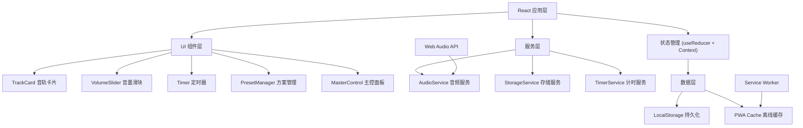

## 1. 架构设计



## 2. 技术描述

- **前端框架**：React 18 + TypeScript 5
- **构建工具**：Vite 5
- **样式方案**：Tailwind CSS 3 + CSS Variables
- **音频处理**：Web Audio API（原生，无第三方库）
- **状态管理**：React Context + useReducer（轻量级，无需 Redux）
- **数据持久化**：LocalStorage（本地存储混音方案）
- **PWA 支持**：vite-plugin-pwa（离线缓存、后台播放、安装到桌面）
- **图标库**：Lucide React（轻量级 SVG 图标）

## 3. 核心目录结构

```
src/
├── components/
│   ├── TrackCard.tsx        # 单个音轨控制卡片
│   ├── VolumeSlider.tsx     # 自定义音量滑块
│   ├── Timer.tsx            # 专注定时器组件
│   ├── PresetManager.tsx    # 混音方案管理
│   ├── MasterControl.tsx    # 主控播放面板
│   └── InstallPWA.tsx       # PWA 安装提示
├── context/
│   └── AudioContext.tsx     # 全局音频状态管理
├── hooks/
│   ├── useAudio.ts          # 音频播放 Hook
│   ├── useTimer.ts          # 定时器 Hook
│   └── useLocalStorage.ts   # 本地存储 Hook
├── services/
│   ├── audioService.ts      # Web Audio API 封装
│   └── storageService.ts    # 存储服务
├── types/
│   └── index.ts             # TypeScript 类型定义
├── data/
│   └── tracks.ts            # 音轨配置数据
├── App.tsx
├── main.tsx
└── index.css
```

## 4. 类型定义

```typescript
// 音轨配置
interface Track {
  id: string;
  name: string;
  icon: string;
  audioUrl: string;
  color: string;
}

// 音轨状态
interface TrackState {
  id: string;
  enabled: boolean;
  volume: number; // 0-100
}

// 混音方案
interface Preset {
  id: string;
  name: string;
  tracks: TrackState[];
  createdAt: number;
}

// 全局状态
interface AppState {
  isPlaying: boolean;
  masterVolume: number;
  tracks: TrackState[];
  presets: Preset[];
  timer: {
    enabled: boolean;
    duration: number; // 分钟
    remaining: number; // 秒
  };
}

// 状态操作
type Action =
  | { type: 'TOGGLE_PLAY' }
  | { type: 'SET_MASTER_VOLUME'; payload: number }
  | { type: 'TOGGLE_TRACK'; payload: string }
  | { type: 'SET_TRACK_VOLUME'; payload: { id: string; volume: number } }
  | { type: 'SAVE_PRESET'; payload: string }
  | { type: 'LOAD_PRESET'; payload: Preset }
  | { type: 'DELETE_PRESET'; payload: string }
  | { type: 'START_TIMER'; payload: number }
  | { type: 'STOP_TIMER' }
  | { type: 'TICK_TIMER' }
  | { type: 'RESET_ALL' };
```

## 5. 核心技术实现要点

### 5.1 音频播放实现
- 使用 `AudioContext` 创建音频上下文
- 每个音轨使用独立的 `GainNode` 控制音量
- 主音量使用一个总 `GainNode` 连接所有音轨
- 音频文件使用可循环播放的白噪音资源
- 支持后台播放（设置 `AudioContext` 的 `latencyHint` 为 `'playback'`）

### 5.2 PWA 配置
- 使用 `vite-plugin-pwa` 自动生成 Service Worker
- 配置 `manifest.json` 支持安装到桌面
- 使用 `CacheFirst` 策略缓存音频文件和静态资源
- 支持后台播放（设置 `background-fetch` 权限）

### 5.3 性能优化
- 使用 `React.memo` 优化音轨卡片渲染
- 音量调节使用 `requestAnimationFrame` 平滑过渡
- 音频资源预加载，按需播放
- 使用 `useCallback` 和 `useMemo` 避免不必要的重渲染

## 6. 数据模型

### 6.1 LocalStorage 存储结构

```typescript
// 存储键名
const STORAGE_KEYS = {
  PRESETS: 'white_noise_presets',
  LAST_STATE: 'white_noise_last_state',
  SETTINGS: 'white_noise_settings',
};

// 上次播放状态（刷新后恢复）
interface LastState {
  tracks: TrackState[];
  masterVolume: number;
  timestamp: number;
}
```

### 6.2 音轨配置数据

```typescript
export const TRACKS: Track[] = [
  {
    id: 'rain',
    name: '雨声',
    icon: 'CloudRain',
    audioUrl: '/audio/rain.mp3',
    color: '#7fb8a3',
  },
  {
    id: 'stream',
    name: '溪流',
    icon: 'Waves',
    audioUrl: '/audio/stream.mp3',
    color: '#6bb8c9',
  },
  {
    id: 'fire',
    name: '篝火',
    icon: 'Flame',
    audioUrl: '/audio/fire.mp3',
    color: '#e8a87c',
  },
  {
    id: 'cafe',
    name: '咖啡馆',
    icon: 'Coffee',
    audioUrl: '/audio/cafe.mp3',
    color: '#c38d9e',
  },
  {
    id: 'fan',
    name: '风扇',
    icon: 'Wind',
    audioUrl: '/audio/fan.mp3',
    color: '#85dcb8',
  },
  {
    id: 'ocean',
    name: '海浪',
    icon: 'Ship',
    audioUrl: '/audio/ocean.mp3',
    color: '#41b3a3',
  },
];
```
